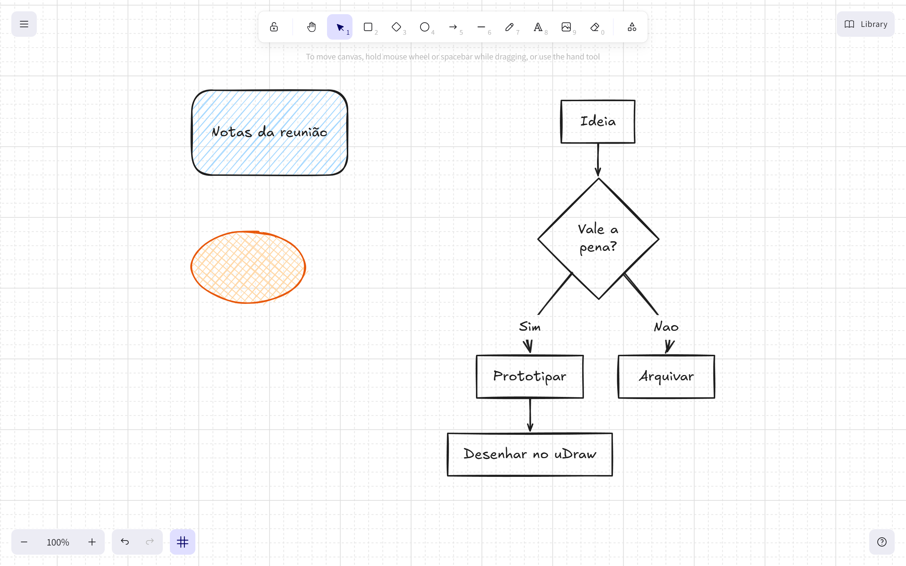

# uDraw

[](LICENSE)
[](https://tauri.app)

Um quadro branco Excalidraw, só que rodando no seu computador em vez do navegador — com arquivos de verdade salvos no seu disco, funcionando sem internet, e uma forma de transformar diagramas Mermaid em desenho editável.



## Por que isso existe

O [Excalidraw](https://excalidraw.com) é, de longe, a melhor ferramenta de desenho à mão livre que existe hoje — mas ele é feito para o navegador: os desenhos vivem no `localStorage` da aba, e "salvar" normalmente significa exportar um `.excalidraw` manualmente. Eu queria a mesma experiência de desenho, só que como um programa de verdade: com `Ctrl+S`, arquivos no Explorer, funcionando num avião sem wifi. E já que ia construir isso, aproveitei para resolver outro incômodo — poder escrever um diagrama em Mermaid e ter ele virar formas normais do Excalidraw, editáveis com as mesmas ferramentas de qualquer outro desenho, em vez de ficar preso numa imagem estática.

O uDraw é isso: o motor de desenho do Excalidraw, embutido como está (mesmas ferramentas, mesmo visual, mesmos atalhos), dentro de um app desktop feito com [Tauri](https://tauri.app), com persistência local e inserção de Mermaid por cima.

Este é um projeto pessoal e independente — não é afiliado, endossado nem mantido pela equipe do Excalidraw ou do Mermaid. Ele só existe porque os dois são open source.

## O que ele faz

- **É o Excalidraw de verdade.** Usa o pacote oficial `@excalidraw/excalidraw`, então todas as ferramentas estão lá desde o primeiro dia: formas, texto, setas com vínculo, mão livre, imagens, frames, bibliotecas, undo/redo.
- **Desenha à mão e vira forma.** A ferramenta "autoshape" (aninhada junto do lápis, na barra de ferramentas) reconhece um retângulo, círculo, diamante, linha ou seta desenhados à mão livre e troca o rabisco pela forma geométrica limpa correspondente — sem precisar soltar o mouse e escolher a ferramenta certa.
- **Funciona sem internet.** As fontes são servidas do próprio app; nenhuma requisição sai para a rede. A política de segurança do Tauri não permite nenhuma origem externa.
- **Salva arquivos de verdade.** `.udraw` é a extensão nativa, mas o conteúdo é o mesmo JSON do Excalidraw — o mesmo arquivo abre em `excalidraw.com` e vice-versa. Gravação atômica, autosave com recuperação após queda, lista de recentes, abrir com duplo-clique no Explorer.
- **Converte diagramas Mermaid em desenho de verdade.** Escreva o código, veja o preview, insira — o diagrama vira elementos nativos do canvas, editáveis com qualquer ferramenta. A conversão é única: depois de inserido, é só desenho comum, sem vínculo escondido com o código.
- **Grade opcional**, com um botão dedicado ao lado do zoom.
- **Exporta PNG e SVG**, com opção de copiar direto para a área de transferência.

## Instalação

A forma mais simples é baixar o instalador pronto na [página de releases](../../releases/latest) — `uDraw_x.y.z_x64-setup.exe` (NSIS) ou o `.msi`, ambos para Windows. Nenhum dos dois exige nada além do WebView2, que já vem com o Windows 10/11.

Se preferir compilar você mesmo, ou estiver noutra plataforma, veja [Desenvolvimento](#desenvolvimento) abaixo.

## Desenvolvimento

Requisitos: Node 20+, Rust 1.77+ e as dependências de build do Tauri para a sua plataforma (no Windows, o WebView2 já vem com o sistema).

```bash
npm install          # também copia as fontes do Excalidraw para public/fonts
npm run tauri dev    # sobe o app desktop
```

| Comando | O que faz |
|---|---|
| `npm run tauri dev` | Executa o app desktop com hot reload |
| `npm run tauri build` | Gera o instalador para a plataforma atual |
| `npm test` | Testes unitários da lógica pura (vitest) |
| `npm run smoke` | Testes de integração num Chromium real (exige `npm run dev` rodando) |
| `npm run build` | Typecheck + bundle do frontend |
| `npm run release` | Compila e publica os instaladores como release no GitHub |

### Sobre a versão do Excalidraw

`@excalidraw/excalidraw` está fixado (sem `^`) numa build **canary** —
`0.18.0-afa3a65`, publicada direto do branch `master` deles, não numa versão
estável — porque é a única forma de ter o "autoshape" hoje: a feature foi
mesclada lá em julho e ainda não saiu numa versão estável no npm. Além do
autoshape, essa build carrega meses de outras mudanças do master, incluindo
breaking changes reais na API que este projeto já adaptou (`excalidrawAPI` →
`onExcalidrawAPI`, a função `restore()` foi removida em favor de
`restoreElements` + `restoreAppState`, `scrollToContent` saiu do
`ExcalidrawImperativeAPI` em favor de `zoomToFitBounds`, e
`MainMenu.DefaultItems.ToggleTheme` passou a exigir a prop
`allowSystemTheme`) — quem for atualizar essa dependência deve esperar mais
quebras do mesmo tipo, não só a troca de versão.

Assim que o Excalidraw publicar uma versão estável com o autoshape incluído,
o caminho é trocar para ela e voltar a usar `^` normalmente.

## Estrutura

```
src-tauri/src/
  lib.rs          menu nativo, instância única, abertura por argv
  document.rs     leitura e gravação atômica (temp + rename)
  recents.rs      lista de arquivos recentes
  recovery.rs     rascunho de autosave para recuperação
src/
  canvas/         wrapper do <Excalidraw> e menu interno
  document/       formato, abrir/salvar, autosave, exportação
  mermaid/        conversão e inserção de diagramas
  shell/          diálogos modais
```

A camada Rust é fina de propósito: só faz o que o JS não consegue (IO confiável,
menu nativo, argv, associação de extensão). Toda a lógica de aplicação é React.

## Atalhos

| Atalho | Ação |
|---|---|
| `Ctrl+N` | Novo desenho |
| `Ctrl+O` | Abrir |
| `Ctrl+S` | Salvar |
| `Ctrl+Shift+S` | Salvar como |
| `Ctrl+Shift+M` | Inserir diagrama Mermaid |
| `Ctrl+Shift+E` | Exportar PNG |
| `Ctrl+'` | Mostrar/ocultar a grade (ou o botão ao lado do zoom) |

Não há menu **Editar** nativo de propósito: acelerador nativo em `Ctrl+C`/`Ctrl+V`/
`Ctrl+Z` engoliria as teclas que o Excalidraw precisa para copiar e desfazer no canvas.

## Grade

O botão ao lado do zoom, no canto inferior esquerdo, liga e desliga a grade. Ele
entra na própria linha do rodapé do Excalidraw via portal, então acompanha o
espaçamento, o tema claro/escuro e o layout responsivo do editor sem coordenadas
fixas. O estado é compartilhado com o atalho nativo `Ctrl+'`: usar um reflete no
outro. Como `gridModeEnabled` é gravado no arquivo, alternar a grade marca o
documento como modificado.

## Publicando uma versão

`scripts/release.mjs` compila e sobe os instaladores para um release do GitHub:

```bash
npm run release -- --dry-run     # mostra o que faria, sem publicar
npm run release                  # compila e publica v<versao>
npm run release -- --skip-build  # reaproveita os instaladores ja compilados
npm run release -- --draft       # publica como rascunho
```

A versão vem de `src-tauri/tauri.conf.json` (a que realmente vai para o
instalador) e o script aborta se ela divergir da do `package.json`. Antes de
publicar ele confere que o `gh` está autenticado, que há um remote `origin` e que
a árvore de trabalho está limpa, e recusa instaladores que não sejam da versão
atual — assim um `.exe` sobrando de um build anterior nunca vai junto. Se o
release já existir, os arquivos são reenviados com `--clobber` em vez de falhar.

## Formato de arquivo

`.udraw` e `.excalidraw` são o mesmo JSON. A serialização usa o `serializeAsJSON`
do próprio Excalidraw, que já descarta estado efêmero (seleção, colaboradores,
cursor) e embute só as imagens realmente referenciadas.

```jsonc
{
  "type": "excalidraw",
  "version": 2,
  "source": "udraw",
  "elements": [ /* ... */ ],
  "appState": { "viewBackgroundColor": "#ffffff" },
  "files": { /* imagens em dataURL */ }
}
```

A gravação é atômica (arquivo temporário + rename), então uma queda no meio da
escrita nunca trunca um desenho existente.

## Diagramas Mermaid

`Ctrl+Shift+M` abre o editor: código à esquerda, preview à direita renderizado
com o mesmo `exportToSvg` do canvas — o que você vê é exatamente o que será
inserido. Ao confirmar, os elementos entram agrupados, centralizados no viewport
e já selecionados, como **uma única** entrada de undo.

### Limitação herdada do conversor

Só existem conversores nativos para cinco tipos de diagrama:

| Tipo | Resultado |
|---|---|
| `flowchart` / `graph` | formas nativas editáveis |
| `sequenceDiagram` | formas nativas editáveis |
| `classDiagram` | formas nativas editáveis |
| `erDiagram` | formas nativas editáveis |
| `stateDiagram` | formas nativas editáveis |
| qualquer outro (`pie`, `gantt`, `mindmap`, `gitGraph`, `journey`, `timeline`...) | **uma única imagem**, não editável forma a forma |

O painel avisa antes de inserir quando o diagrama vai cair nesse caso, para que a
limitação não seja uma surpresa depois.

## Testes

Os testes unitários cobrem a lógica que não depende do runtime do Excalidraw
(caminhos de arquivo, validação de documento, detecção de tipo de diagrama,
posicionamento e agrupamento). O Excalidraw e o Mermaid precisam de um navegador
de verdade — usam métricas de canvas e `getBBox`, que o jsdom não implementa —
então o resto é coberto por `npm run smoke`, que dirige um Chromium real contra o
dev server e importa os módulos do próprio app (`/src/...`) via Vite.

O smoke test verifica, entre outras coisas: que o canvas monta, que nenhuma
requisição externa é feita, que um flowchart vira formas com setas vinculadas,
que um `pie` cai para imagem e é sinalizado, que o round-trip de `.udraw`
preserva ids e agrupamento, e que a exportação grava um PNG válido.

## Licença

MIT — veja [LICENSE](LICENSE). É a mesma licença de todas as bibliotecas em que
este projeto se apoia diretamente: `@excalidraw/excalidraw`,
`@excalidraw/mermaid-to-excalidraw`, React e o próprio Tauri (que é MIT/Apache-2.0
dual, e aqui usado sob os termos MIT).

## Créditos

O uDraw não existiria sem o trabalho de duas equipes:

- **[Excalidraw](https://github.com/excalidraw/excalidraw)** — o motor de desenho inteiro (canvas, formas, texto, o visual à mão livre) é o pacote deles, usado como está.
- **[Mermaid](https://github.com/mermaid-js/mermaid)** e o conversor **[mermaid-to-excalidraw](https://github.com/excalidraw/mermaid-to-excalidraw)** — tornam a inserção de diagramas possível.
